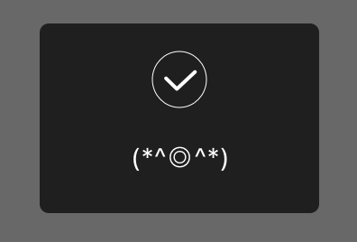

# 自定义 MBProgressHud 示例

一个自定义 MBProgressHud 的例子。包含两个 custom view：

1. 加载成功：

	
	
2. 加载中(gif 动画)：

	
	
	
## 用法

### 添加文件

将 demo 项目中的 Custom 文件组中所有文件拖到你的项目中。此外项目还需要依赖 MBProgressHUD 框架。

### import

在你的 view controller 中导入头文件：
	
	#import "UIViewController+CustomMBHUD.h"
	
这样就可以在你的 view controller 调用相应的方法李。

### 显示加载成功

	[self showMarkWithText:@"(*^◎^*)" duration:5];
	

	
### 显示加载中

	[self showLoading];
	

隐藏：

	 [self closeLoading];

